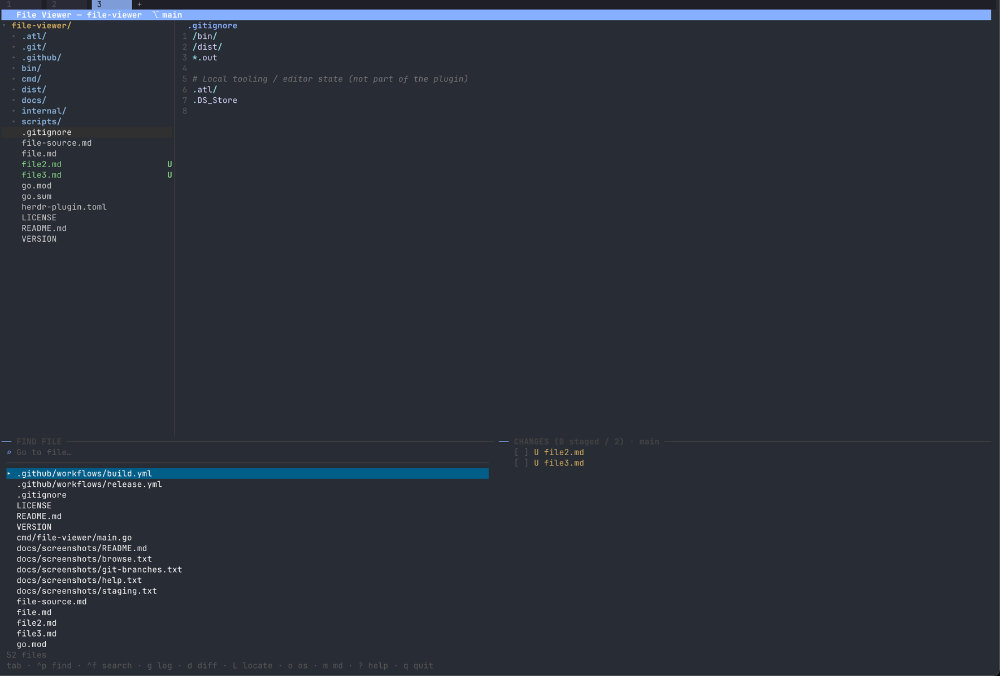

# File Tree — a Herdr plugin

[](https://github.com/ismaelosuna7824/herdr-file-viewer/actions/workflows/build.yml)
[](https://go.dev)
[](LICENSE)


A lightweight, mouse-enabled **project file tree** for
[Herdr](https://herdr.dev), written in Go with
[Bubble Tea](https://github.com/charmbracelet/bubbletea). The default plugin
pane is a narrow right sidebar: folders expand in place and files open as real
Herdr tabs. Preview, search, and git panels are not started in this mode.

This MediaNet fork builds on
[ismaelosuna7824/herdr-file-viewer](https://github.com/ismaelosuna7824/herdr-file-viewer)
and keeps its MIT license and upstream attribution. The original full viewer
code remains available without `--tree-only`; the linked plugin uses the lean
tree mode and the plugin ID `medianeth.file-viewer`.

## Retained full-viewer preview

The upstream-style four-panel mode remains available for direct use, but is not
the default Herdr plugin pane:



Plain-text renders of other views live in
[`docs/screenshots/`](docs/screenshots).

## Features

Three things in one pane:

- **File browser** — a navigable, lazily-expanded directory tree with **git
  status decorations**: modified, new, deleted and renamed files are colored and
  badged, and directories containing changes are tinted (VS Code style). Click a
  folder to toggle it; click a file to open a read-only tab in the same Herdr
  workspace.
- **Rendered markdown** — `.md` files display as formatted documents (headings,
  lists, code blocks) via glamour; press `m` to toggle to raw source.
- **Persistent search panel** — always docked bottom-left. `Ctrl+P` focuses it in
  fuzzy file-find mode, `Ctrl+F` in content-search mode (with case-sensitive
  `Aa`, whole-word `ab` and regex `.*` toggles). Arrow keys preview each result
  live in the file view; `Enter` opens it.
- **Persistent git panel** — always docked bottom-right, titled with the current
  branch. Focus it with `g` or `Tab`; press `g` again to toggle between the
  **commit history** (Enter opens a commit's full multi-file diff) and the
  **branch list** (Enter switches to the selected branch).
- **Review / diff view** (`d`) — see a file's changes against `HEAD`. Modified
  files render **side-by-side** (old on the left, new on the right, changed lines
  aligned) so you can see exactly what changed; brand-new files render inline as
  all-additions. Press `s` to toggle the layout; narrow panes fall back to
  inline automatically.

The search and fuzzy-find engines are **pure Go standard library** — no
`ripgrep`, no `fzf`. The only external tool is `git`, used solely for the status
decorations; without it (or outside a repo) the viewer still works, just without
decorations.

## Layout

The browse screen is a fixed four-panel workspace:

```
┌───────────────┬─────────────────────────────┐
│ file tree     │ file view (syntax / markdown)│
│               │                              │
├───────────────┴──────────────┬──────────────┤
│ ── FIND FILE / SEARCH ──      │ ── GIT LOG · branch ──
│ (fuzzy find / content search) │ (commit history)      │
└───────────────────────────────┴──────────────┘
```

`Tab` cycles focus through the four panels: tree → file view → search → git log.
`Alt+h/j/k/l` (or `Alt+arrows`) moves focus by direction. The search and
git-log panels are always visible.

The git panel cycles through three views with `g`: **staging** (changed files),
**branches**, and **commit history**.

### Staging view (changes)

A lazygit-style **directory tree** of changed files, with common path chains
collapsed. Each row has a checkbox: `[✓]` staged (green), `[~]` partially staged,
`[ ]` unstaged. Directory rows aggregate their subtree.

| Key | Action |
|-----|--------|
| `space` | Stage / unstage the selected file — or a whole directory subtree |
| `A` / `U` | Stage all / unstage all |
| `c` | Commit the staged changes (prompts for a message) |
| `Enter` | View the selected file's diff |

### Branch view

From the branch view you can drive the whole git flow:

| Key | Action | |
|-----|--------|--|
| `Enter` | Switch to the selected branch | |
| `n` | Create a new branch (from the current one) | prompt |
| `c` | Commit staged changes (stage first with `space`/`A`) | prompt |
| `a` | Amend the last commit with current changes | confirm |
| `u` | Undo the last commit (keeps changes staged) | confirm |
| `m` | Merge the selected branch into the current one | confirm |
| `r` | Rebase the current branch onto the selected one | confirm |
| `x` | Delete the selected branch | confirm |
| `A` | Stage all (`git add -A`) | |
| `t` | Create a tag at HEAD | prompt |
| `f` | Fetch all remotes (prune) | |
| `p` | Pull | |
| `P` | Push | |
| `F` | Force-push (`--force-with-lease`) | confirm |
| `s` / `S` | Stash / stash pop | |
| `H` | Reset `--hard HEAD` (discard all changes) | confirm |

In the **history** view: `y` cherry-picks the selected commit onto the current
branch (confirm), and `R` resets `--hard` the current branch to the selected
commit (confirm).

Anything that rewrites history, deletes, discards, or force-pushes asks for
confirmation first. Any git error (conflicts, refusals, no upstream) is shown in
red inside the panel — nothing silently fails.

## Keys

### Browser

| Key | Action |
|-----|--------|
| `↑`/`k`, `↓`/`j` | Move the cursor |
| `→`/`l`, `←`/`h` | Expand / collapse a directory |
| `Enter` / `Space` | Open a file or toggle a directory |
| `Tab` | Cycle focus through the four panels |
| `Alt+h/j/k/l`, `Alt+arrows` | Move focus by direction |
| `Ctrl+P` | Focus the search panel in file-find mode |
| `Ctrl+F` | Focus the search panel in content-search mode |
| `L` | Locate the open file in the tree (reveal + focus it) |
| `o` | Open the file's location in the OS file manager |
| `e` | Edit the current **file** in your editor ([configurable](#editing-files)) |
| `E` | Open the whole **project** in your editor |
| `d` | Review the selected/open file's diff against `HEAD` |
| `g` | Focus the git-log panel (toggle back to the tree) |
| `m` | Toggle rendered markdown ↔ source (markdown files only) |
| `r` | Refresh git status and the file index (e.g. after a commit) |
| `q` / `Ctrl+C` | Quit |

### Review / diff view (`d`)

Scroll with `↑`/`↓` / `PgUp` / `PgDn`; `s` toggles split ↔ inline; `d`, `Esc`
or `q` return to the browser.

### Git status legend

| Badge | Color | Meaning |
|-------|-------|---------|
| `M` | amber | Modified |
| `U` | green | Untracked (new) |
| `A` | green | Added (staged) |
| `D` | red | Deleted |
| `R` | blue | Renamed |
| `!` | pink | Conflicted |

Decorations appear only inside a git repository; elsewhere the tree renders
plainly.

The search panel is always docked bottom-left. `Ctrl+P` / `Ctrl+F` focus it and
switch it between file-find and content-search; within it, `↑`/`↓` preview and
`Enter` opens. Press `?` any time for the full keybinding reference.

### Content search toggles

The status line always shows each toggle's on/off state. `Ctrl` shortcuts work
everywhere (a terminal can't send `Alt` from macOS's Option key); the `Alt`
aliases work on Linux/Windows.

| Key | Toggle |
|-----|--------|
| `Ctrl+t` (`Alt+c`) | Case sensitive (`Aa`) |
| `Ctrl+w` (`Alt+w`) | Whole word (`ab`) |
| `Ctrl+r` (`Alt+r`) | Regular expression (`.*`) |

## Local install (this fork)

```sh
cd /Users/jomar/Documents/Work/medianeth/herdr-file-viewer
sh scripts/fetch-or-build.sh
herdr plugin link /Users/jomar/Documents/Work/medianeth/herdr-file-viewer
```

The local link command does not run `[[build]]`, so build the binary first. This
fork intentionally builds from source with Go 1.25+; using the upstream release
binary would omit mouse-driven Herdr tabs.

The original plugin is available separately as
`ismaelosuna7824/herdr-file-viewer`, but it does not include this fork's mouse
or file-tab behavior.

### Local development

```sh
go test ./...
go build -o bin/file-viewer ./cmd/file-viewer
herdr plugin link "$PWD"
```

## Opening the viewer

New Herdr projects automatically open with their normal CLI pane on the left
and the narrow file tree on the right. The tree does not steal focus. Existing
projects can still open or restore the same layout through the actions below.

The manifest exposes two actions in Herdr's action menu:
**Open File Tree** / **Open File Tree (tab)**. This fork's plugin pane renders
only the expandable file tree; clicking a file opens it in a real Herdr tab.
The full upstream-style viewer remains available from the binary without the
`--tree-only` flag.

### Custom keybindings

To use different keys, add them to `~/.config/herdr/config.toml`, invoking the
plugin's actions (`open` = split, `open-tab` = tab):

```toml
[[keys.command]]              # open beside your work (split)
key = "prefix+f"
type = "plugin_action"
command = "medianeth.file-viewer.open"

[[keys.command]]              # …or in its own tab
key = "prefix+shift+f"
type = "plugin_action"
command = "medianeth.file-viewer.open-tab"
```

Swap `prefix+f` / `prefix+shift+f` for whatever keys you like. Reload Herdr (or
your config) for the changes to take effect. Once open, press `?` for the full
in-app keybinding reference.

Herdr plugin panes belong to one tab, so each file tab opened by this plugin
gets its own narrow tree split on the right. Clicking the same absolute path in
the same workspace focuses its existing tab; closed-tab records are detected
and replaced automatically. After a full Herdr restart, focusing a restored tab
rehydrates its saved file and tree inside the existing panes. Each tab also
remembers its expanded folders and selected tree row. In a file tab, drag across
text with the mouse and release to use Herdr's native highlight-and-copy behavior;
the selected text is placed on the clipboard automatically.

## Editing files

The viewer is read-only, but it opens **your** editor on demand — it never
bundles one:

- `e` — open the current **file**
- `E` — open the whole **project** (the workspace directory)

Terminal editors open right in the pane and hand it back on exit; GUI editors
open their own window. After you save and close, the viewer reloads the file and
git status.

### Configuring editors

List one or more editors in a config file — pick a **default**, or get a
**picker** to choose each time. The file lives at:

```
$HERDR_PLUGIN_CONFIG_DIR/editors
```

On macOS that's usually
`~/.config/herdr/plugins/config/medianeth.file-viewer/editors`. One editor per
line, `name = command`. A leading `*` marks the default; the file or project
path is appended automatically, so **don't** add a trailing `.`:

```ini
# A leading * = default (e/E open in it directly, no prompt).
# No default → you're asked which editor to use.
* zed = open -a Zed
  code = code
  nvim = nvim
  nano = nano
```

**macOS tip:** use `open -a <App Name>` for GUI editors — it finds the app by
name and needs no CLI on your `PATH` (a bare `zed`/`code` only works if you've
installed their command-line tool). If an editor fails to launch, the viewer now
shows the error in the footer instead of failing silently.

Linux/other: use the command directly, e.g. `code`, `zed`, `nvim`, `subl`.

**No config file?** It falls back to a single editor from the first of
`$FILE_VIEWER_EDITOR`, `$VISUAL`, or `$EDITOR`.

## Updating

On startup the viewer checks GitHub for a newer release and shows a notice in the
header (e.g. `⬆ v0.1.4 available`) when one exists. To update, re-run the install
command — it pulls the latest and rebuilds/downloads the binary:

```sh
herdr plugin install ismaelosuna7824/herdr-file-viewer
```

## Develop

```sh
go build ./...      # compile everything
go test ./...       # run the engine + UI composition tests
go build -o bin/file-viewer ./cmd/file-viewer   # what the build step runs
```

You can also run the binary directly outside Herdr against any directory:

```sh
./bin/file-viewer /path/to/project
```

With no argument it uses the workspace directory from Herdr's context, falling
back to the current working directory.

## Project structure

```
cmd/file-viewer/   entrypoint — the binary Herdr launches in the pane
internal/
  explorer/        navigable directory-tree model
  filetab/         standalone read-only file-tab TUI
  finder/          fuzzy file-path matcher (right-to-left, basename-biased)
  search/          pure-Go content search engine + .gitignore matcher
  gitstatus/       git working-tree status (shells out to `git`)
  gitdiff/         parsed diff (file vs HEAD, or a whole commit) via `git`
  gitlog/          commit history + branch/git operations
  herdr/           CLI bridge for opening and naming workspace tabs
  reveal/          open a path in the OS file manager (cross-platform)
  viewer/          read-only file content pane with line numbers
  ui/              Bubble Tea app that composes the above (Model-Update-View)
```

## Notes & limits

- The `.gitignore` support is pragmatic, not spec-complete: directory names,
  `*.ext` patterns and anchored paths are honoured; negation (`!`) and nested
  `.gitignore` files are not. A built-in list (`.git`, `node_modules`, `dist`,
  …) is always skipped.
- Content search caps at 5000 matches and skips binary and very large files to
  stay responsive; the status line flags a truncated result.
- Syntax highlighting runs asynchronously (files open instantly as plain text,
  colours arrive a beat later) so scrolling the tree never stutters.

## Built with

- [Bubble Tea](https://github.com/charmbracelet/bubbletea) — TUI framework
- [Lip Gloss](https://github.com/charmbracelet/lipgloss) — styling
- [Chroma](https://github.com/alecthomas/chroma) — syntax highlighting
- [Glamour](https://github.com/charmbracelet/glamour) — markdown rendering

## Contributing

Issues and PRs welcome. `go test ./...` and `gofmt -l .` must stay clean (CI
enforces both across Linux, macOS and Windows).

## License

[MIT](LICENSE) © ismaelosuna7824
